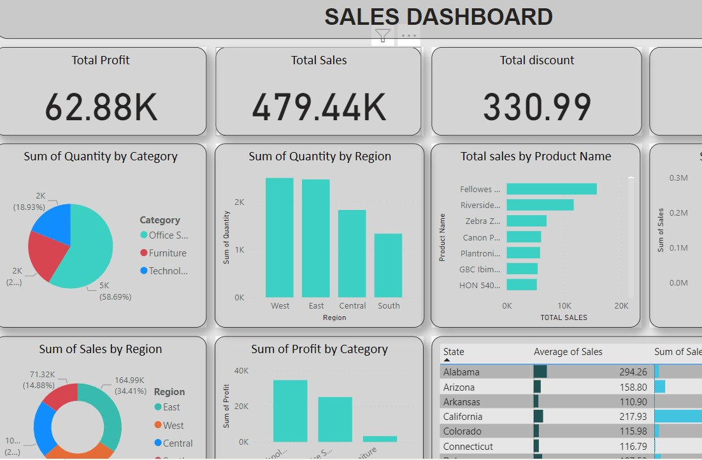

# Sales-Dashboard
This project harnesses advanced data analytics and Power BI visualization techniques to meticulously analyze and present key patterns in sales analysis

Project Steps:

Requirement Gathering: Collate and ascertain stakeholders' precise requirements and expectations regarding key performance indicators (KPIs) and visualization needs.

Data Overview: Conduct an in-depth examination of the dataset, comprehending its structure, variables, and potential interconnections between disparate data sources.

Data Integration with Power BI: Import the dataset into Power BI and establish cohesive linkages between different data sources, if applicable.

Data Cleansing: Utilize the Power Query Editor within Power BI to systematically clean the dataset, rectify inconsistencies, manage missing data, and format it for comprehensive analysis.

Data Modeling: Forge meaningful relationships between dataset elements, fostering an optimized data structure conducive to insightful analysis.

Background Design in PowerPoint: Develop visually engaging and professionally crafted backgrounds or templates for Power BI reports, ensuring consistency and aesthetic appeal.

Data Visualization and Charting: Employ Power BI's diverse visualization tools to craft an array of visual representations (e.g., bar charts, line graphs, geographical maps) aligning with specified analysis requirements.

Dashboard Creation: Orchestrate a cohesive dashboard layout within Power BI, effectively presenting curated visualizations that swiftly convey essential insights to stakeholders.

Insight Synthesis: Leverage extracted insights to construct a coherent narrative, elucidating pertinent trends, patterns, and consequential findings derived from the analysis.

Key Insights:

Total Sales and Profit : A total Sales of  479,440 and total profit of 62,880  were recorded.
Quantity by category:  Office supplies has the highest quantity supplied at 5,000 (58.69%), while other categories exhibited notably lower quantity rate.
Sales by Region : East areas reported 164,990 sales, accounting for 34.41% of the total, the west areas reported 139,900 sales, accounting for 29.18% ,while south areas had 71,320 sales (14.88%).
Recommendations:

Ensure the utilization of Power BI functionalities proficiently, employing DAX expressions for calculations, custom columns, and measures for insightful data representation. Prioritize clear, concise, and visually compelling presentation to effectively communicate sensitive casualty data.

Regular stakeholder communication is imperative for aligning outcomes with expectations and ensuring the ethical and respectful handling of the data.
